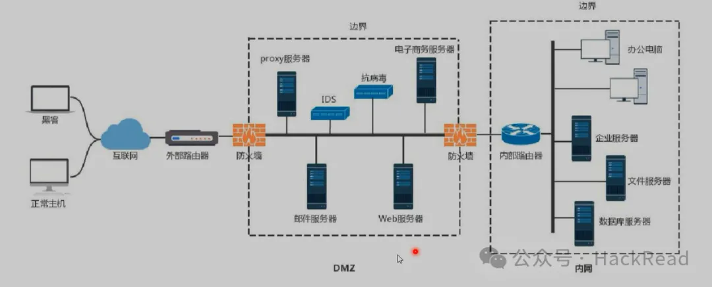

# 内网信息收集

## 1.工作组和域环境

* 工作组：一群计算机的集合，要访问其中的计算机，要到被访问计算机上实现用户验证
* 域：有安全边界计算机集合，域之间相互访问则需要建立信任关系，同一个域中计算机彼此已经建立信任关系

## 2.基本公司网络架构

* 互联网
* dmz（隔离区；非军事化区）
* 内网

AD域控制器一般部署在Windows server系统

## 3.基本信息收集

* systeminfo：查看计算机版本，补丁等
* net start：查看启动的服务
* tasklist：查看进程列表
* powershell "Get-WmiObject -class Win32_Product |Select-Object -Property name,version"：擦好看安装软件版本信息
* ipconfig /all：判断存在域DNS，有域的有dns后缀，无域的无dns后缀
* net time /domain：获取主域名；nslookup 域名 或者 ping 域名：获取主域名的ip地址
* netstat -ano：查看当前网络端口开放
* net user：获取本地用户
* net user /domain：获取域用户信息
* netsh wlan show profiles：获取连接过的wifi名
* netsh wlan show profile name="NUDT" key=clear：获取NUDT中的wifi密码