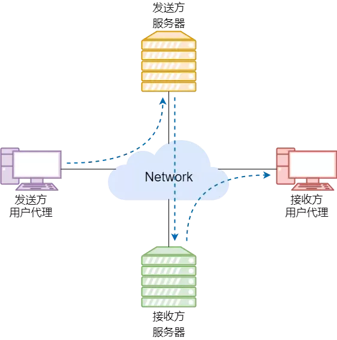

# TCP/IP 网络模型

> TCP/IP模型的出现要早于OSI模型，它是由美国国防部创建的,是迄今为止发展最成功的通信协议，被用于构筑目前最大的、开放的互联网络系统Internet
>
> TCP/IP是一组通信协议的**代名词**（其中包含一百多个协议），这组协议使任何具有网络设备的用户能访问和共享Internet上的信息，其中最重要的协议是传输控制协议（TCP）和因特网协议（IP）

[TOC]

## 一. 应用层（Application Layer）

* 相当于OSI模型的应用层，表示层，会话层的服务总和

* 最上层的，也是我们能够直接接触到的，是工作在操作系统的用户态，传输层以下则工作在内核态
* **应用程序**有很多，包括 Web 浏览器、电子邮件、远程登录、文件传输、网络管理等。这些应用程序都会使用应用协议进行通信，应用协议正是为了实现应用程序的功能而设计和创造
* **应用层的目的是向应用程序提供网络接口，直接向用户提供服务**，应用层只关注于为用户提供应用功能，比如HTTP，FTP，Telnet，DNS，SMTP
* 不用关心数据是如何传输的，就类似于寄快递的时候我们只需要把包裹交递给快递员

### 1.1 远程登陆

> 网络设备的管理方式分为本地管理和远程管理。远程管理是从本地主机登录到网络对端设备，向其发送管理数据，并在实际中比较常用，不受物理位置的限制。远程登录主要使用Telnet和SSH两种协议

#### 1.1.1 Telnet

* **Telnet 协议**（全名为电传网络（teletype network））定义了一台设备通过 IP 网络向远端设备发起**==明文==**管理连接的通信标准，可以在一台设备上通过 Telnet 协议与一台远端设备建立管理连接，并对远端设备实施配置和监控，这种方式的体验与本地登录设备并无区别

* **Telnet 协议通过 TCP 协议建立服务器和客户端的一条连接，并通过这条连接向服务器发送用户名、密码和命令。**Telnet 协议使用的是 **TCP 23 端口**，表示客户端在发起 Telnet 连接时，默认连接服务器的 TCP 23 号端口

* 当 Telnet 客户端输入命令后，这些命令通过 TCP 连接发送到 23 号端口，监听请求的守护进程 Telnetd 收到后，将命令发送给 Shell ，Shell 为操作系统进行命令解释，然后操作系统执行 Telnet 客户端发出的命令。同理，操作系统按照相反的顺序，将命令执行的结果发回给 Telnet 客户端
* Telnet 协议实现了远程命令传输，但是客户端和服务器跨越不可靠的公共网络时，在命令传输过程中可以截获 Telnet 通信的所有数据，然后使用截获的用户名和密码来通过 Telnet 服务器的身份认证，并登录到设备上对配置文件进行修改，所以Telnet协议存在重大安全隐患，不建议在实验室以外的环境使用

#### 1.1.2 SSH

SSH （secure shell）协议全程是安全外壳协议，目的就是为了取代 Telnet ，SSH 是**==加密==**的远程登录协议，它通过在网络中创建安全隧道来实现 SSH 客户端和服务器之间的连接，提供更加安全的远程登录服务

### 1.2 文件传输

> 文件传输协议提供的服务可以满足我们的从远端设备传输文件的需求

#### 1.2.1FTP

**FTP** 用于服务器和客户端之间传输文件，是 IP 网络上传输文件的通用协议。FTP 采用客户端和服务器的模式，使用 **TCP** 协议提供可靠传输。FTP 可以对登录服务器的**用户名和密码进行验证**，允许客户端指定文件的**传输类型**，并且可以设置文件的**传输权限**

FTP 使用两条 TCP 连接实现文件传输：

* 一条是 **FTP 控制连接**，用来控制管理（**TCP 21 号端口**）
* 另一条是 **FTP 数据连接**，用于数据传输（**端口 20** ）

#### 1.2.2 TFTP

**TFTP** 也是用于服务器和客户端之间传输文件的，对比 FTP ，TFTP 没有复杂的交互接口和认证控制，适用于不需要复杂交互的网络环境，使用 **UDP** 协议传输，服务器使用端口号 69 侦听 TFTP 连接。由于 UDP 不能提供可靠的数据传输，因此 TFTP  使用超时重传机制确保数据正确发送。TFTP  只能提供简单的文件传输能力，包括文件的上传和下载。不支持文件目录功能，也不能对用户的身份进行验证和授权

### 1.3 电子邮件

> 通过电子邮件，可以发送文字**内容**、**图片**，还可以发送**报表数据**等所有计算机可以存储的信息

#### 1.3.1 通信架构

电子邮件在几十年的发展过程中出现了明显的变化，从原始的发送方电脑直接向接收方电脑发送电子邮件，演变成**收发双方都使用邮件服务器代为收发邮件**。通过这种方式，电子邮件通信不再依赖接收方当前是否在线，而电子邮件的通信过程由简单的发送方到接收方，演变成*发送方电脑到发送方邮件服务器*，*发送方邮件服务器到接收方邮件服务器*，以及接收方邮件服务器到接收方电脑的三个通信过程。并且参与通信的四方都不是直接相连，而是分别独立连接到互联网中。这个架构中，邮件发送方和接收方使用的电脑称为**用户代理**。

#### 1.3.2 邮件地址

使用电子邮件时，需要拥有一个地址，这个地址叫做**邮件地址**，也叫**邮箱地址**。它相当于通信地址和姓名。电子邮件如下：

networkfox@qq.com

networkfox 表示**用户的名称**，同一个通信地址内，名称必须是唯一的，不能出现重复；@ 表示**分隔符**；[http://qq.com](https://link.zhihu.com/?target=http%3A//qq.com) 是**用户邮箱的邮件接收服务器的域名**

#### 1.3.3 SMTP协议

提供电子邮件服务的协议叫做 **SMTP** 。SMTP 用于收发双方的**邮件服务器之间**，而不是用户代理和邮件服务器之间的通信方式。在实际使用中，发送方用户代理与发送方服务器之间也常采用 SMTP 协议，SMTP 为了实现高效发送邮件内容，在传输层使用了 **TCP 协议**，**端口号是 25** 。在一台邮件服务器向另一台邮件服务器发送邮件时，首先向对方的 TCP 25 端口发起一条连接。然后利用这条 TCP 连接发送控制消息和数据

安全缺陷：

- SMTP 传输的邮件是**明文**的形式，没有提供数据加密机制，可以看到邮件传输的具体内容，用户信息的机密性无法得到保障。
- SMTP 没有提供任何**认证机制**，即使使用了伪造的发件人邮件地址也无法识别，会出现冒名顶替的安全问题。

漫天的广告邮件和包含钓鱼链接的垃圾邮件成为日益严重的问题。为了修正 SMTP 出现的问题，IETF 定义了扩展的 SMTP ，即 ESMTP 。**ESMTP** 提供的扩展功能中包括**认证机制**和**加密机制**等

#### 1.3.4 POP3协议

**POP3** 协议是用于接收电子邮件的协议。发送端的邮件使用 SMTP 协议将电子邮件转发给一直在线的 POP3 服务器。客户端再根据 POP3 协议从 POP3 服务器接收邮件。这个过程中，为了防止别人盗取邮件内容，还要进行用户认证

POP3 协议和 SMTP 协议一样，是基于 TCP 的应用层协议，使用 **TCP 110 端口**连接邮件服务器。接收方的邮件客户端程序首先使用 TCP 连接到 POP3 服务器的 TCP 端口 110 ；再进行**用户认证**、**邮件列表查询**、**邮件下载**、**邮件删除**等操作；操作完成后，客户端与邮件服务器之间再断开 TCP 连接

#### 1.3.5 IMAP协议

POP3 协议的邮件客户端能够在邮件服务器上执行的操作很少，而且邮件要下载到客户端本地，而不保留在邮件服务器，实际使用时很不方便。目前使用更广泛的接收电子邮件的协议是 **IMAP** 。**在 IMAP 中邮件则由服务器进行管理**。*使用 IMAP 时，不必从服务器上下载所有的邮件也可以查看。*由于 IMAP 是在服务器端处理 MIME 信息，它可以实现邮件附件的选择性下载功能

### 1.4 WWW

> **万维网**（ **WWW** ）是将互联网的信息以超文本形式展现的系统，也叫做 **Web** 。可以显示 WWW 信息的客户端软件叫做 **Web 浏览器**，有时简称为浏览器
>
> WWW 有 3 个重要的概念，它们分别是访问信息的方式和位置（ **URI** ）、信息的表现形式（ **HTML** ）以及信息传输（ **HTTP** ）等操作

#### 1.4.1 URI

**URI** 用于标识资源，是一种高效的识别码，被应用于主页地址、电子邮件、电话号码等，通常主页地址被叫做 **URL** 。URL 常用来表示网络资源的具体位置。但是 URI 不限于标识互联网资源，可以作为所有资源的标识符。简单说就是 URL 是 URI 的一个子集

url（Uniform Resource Locator统一资源定位符）的作用：

* url一般是一个完整的链接，我们可以直接通过这个链接（url）访问到一个网站，或者把这个url复制到浏览器访问网站。
  使用URL时我们就是一个直接用户的角色，直接访问就完事了

uri（Uniform Resource Identifier统一资源标识符）的作用：

* uri并不是一个直接访问的链接，而是**相对地址**（当然如果相对于浏览器那么uri等同于url了）。这种概念更多的是用于编程中，因为我们没必要每次编程都用绝对url来获取一些页面，这样还需要进行分割“http://xx/xxx”前面那一串，所以编程的时候直接request.getRequestURI就行了，当然如果是重定向的话，就用URL。
  

#### 1.4.2 HTML

**HTML** 是用来描述 Web 页的一种语言。它可以指定浏览器中显示的文字、文字的大小和颜色，还可以对图像、动画或音频进行设置

#### 1.4.3 HTTP

在浏览器的地址栏里输入 Web 页的 URL 后，HTTP 的处理就开始了。**HTTP** 默认使用 80 端口。它的工作机制，首先是客户端向服务器的 80 端口建立一个 TCP 连接，然后在这个 TCP 连接上进行请求和应答以及数据报文的发送

HTTP 中常用的有两个版本，一个是 **HTTP 1.0** ，另一个是 **HTTP 1.1** 。在HTTP 1.0 中每一个命令和应答都会触发一次 TCP 连接的建立和断开。而从 HTTP 1.1 开始，允许在一个 TCP 连接上发送多个命令和应答，这种方式也叫**保持连接**（ keep-alive ）。可以大量减少 TCP 连接的建立和断开操作，提高传输效率

### 1.5网络管理应用

#### 1.5.1 DHCP

DHCP（Dynamic Host Configuration Protocol，动态主机配置协议）

#### 1.5.2 DNS

DNS（Domain Name System，域名系统，DNS协议运行在UDP协议之上，使用端口号53

DNS就是把域名解析为IP地址，提供我们上网，我们能够上网最终是找到IP地址

## 二. 传输层（Transport Layer）

应用层的数据包会传递给传输层，传输层则是为应用层提供网络支持的

设计理念是简单，高效，专注

### 2.1 TCP传输协议

* TCP全称为传输控制协议（Transmission Control Protocol）
* 大部分应用使用的是TCP传输层协议，比如HTTP应用层协议
* TCP相比UDP多了很多特性：
  * 流量控制
  * 超时重传
  * 拥塞控制

### 2.2 UDP传输协议

* 较为简单，只负责发送数据包，不保证数据包是否能抵达对方
* 但实时性更好，传输效率也高

### 2.3 TCP段（TCP Segment）

* 应用传输的数据可能非常大，因此当传输层的数据包大小超过MSS（TCP最大报文段长度），就要将数据包分块
* 如果途中有一个分块丢失或损坏，只需要重新发送这一个分块，而不需要重新发送整个数据包

### 2.4 端口

* 设备作为接收方时，传输层要负责把数据包传给应用，但是一台设备上可能会有很多应用在接受或者传输数据，因此需要用一个编号将应用区分开来，这个编号就是端口
* 80端口通常是Web服务器用的，22端口通常时远程登录服务器用的
* 由于传输层的报文中会携带端口号，因此接收方可以识别出该报文是发送给那个应用的

## 三. 网络层（Internet Layer）

* 传输层实际上并不负责将数据从一个设备传输到另一个设备
* 我们不希望传输层协议处理太多的事，只需要服务好应用即可，让其作为应用间数据传输的媒介，帮助实现应用到应用的通信，而实际的传输功能就交给了下一层网络层

### 3.1 IP协议（Internet Protocol）

* IP协议会将传输层的报文作为数据部分，再加上IP包头组装成IP报文，若IP报文大小超过MTU（以太网中一般为1500字节）就会再次进行分片
* 网络层负责将数据从一个设备传输到另一个设备，但如何找到对方呢？因此，网络层需要有区分设备的编号
* 一般使用IP地址给设备编号，对于IPv4协议，IP地址共32位，分成了4段，每段是8位。但IP地址虽然做到了区分设备，但是寻址起来就很麻烦，难道全世界那么多设备一个个去匹配？
* 因此，IP地址分成两种意义的：
  * **1.网络号**，负责标识IP地址是属于哪个【子网】的
  * **2.主机号**，负责标识同一【子网】下的不同主机
  * 但是这需要配合**子网掩码**才能计算出IP地址的网络号和主机号
  * 在IP寻址的过程中，先匹配到相同的网络号（表示要找到同一个子网），才回去找对应的主机
* 除寻址外，IP协议还有一个重要的能力就是**路由**。在实际中，两台设备并不是用一条网线连接起来的，而是通过很多网关，路由器，交换机等连接起来的，那么就会形成很多条网络的路径，当数据包到达一个网络节点，就需要通过路由算法决定下一步走哪条路径。
* 路由器寻址工作中，就是要寻找目标地址的子网，找到后进而把数据包转发给对应的网络内
* 所以，IP协议的寻址作用是告诉我们去往下一个目的地该朝哪个方向走，路由则是根据下一个目的地选择路径。寻址更像在导航，路由更像在操作方向盘

## 四. 网络接口层（Link Layer）

* 生成IP头部后，接下来就需要交给网络接口层，在IP头部前面加上MAC头部，并封装成数据帧（Data frame）发送到网络上
* IP 头部中的接收方 IP 地址表示网络包的目的地，通过这个地址我们就可以判断要将包发到哪里，但在以太网的世界中，这个思路是行不通的
* 电脑上的以太网接口，Wi-Fi接口，以太网交换机、路由器上的千兆，万兆以太网口，还有网线，它们都是以太网的组成部分。以太网就是一种在「局域网」内，把附近的设备连接起来，使它们之间可以进行通讯的技术
* 以太网在判断网络包目的地时和 IP 的方式不同，因此必须采用相匹配的方式才能在以太网中将包发往目的地，而 MAC 头部就是干这个用的，所以，在以太网进行通讯要用到 MAC 地址
* MAC 头部是以太网使用的头部，它包含了接收方和发送方的 MAC 地址等信息，我们可以通过 ARP 协议获取对方的 MAC 地址
* 网络接口层主要为网络层提供「链路级别」传输的服务，负责在以太网、WiFi 这样的底层网络上发送原始数据包，工作在网卡这个层次，使用 MAC 地址来标识网络上的设备

* 网络接口层的传输单位是帧（frame），IP 层的传输单位是包（packet），TCP 层的传输单位是段（segment），HTTP 的传输单位则是消息或报文（message）。但这些名词并没有什么本质的区分，可以统称为数据包

