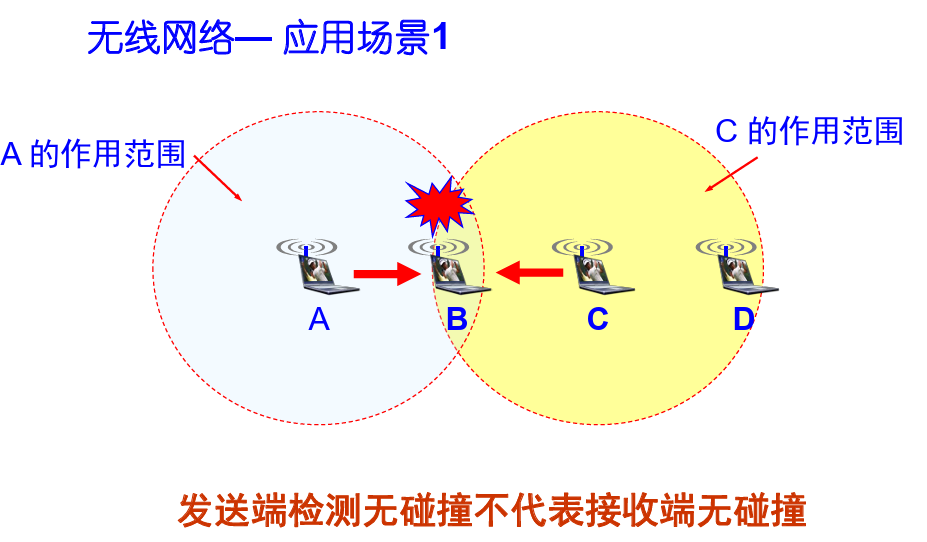

# 无线局域网

## 1.拓扑结构

* 独立BSS
* 有AP的BSS
* 扩展服务集ESS

## 2.协议栈

### 2.1 CSMA/CA协议

* 帧间间隔IFS(InterFrame Space)：

  所有的节点完成发送后，必须再等待一段时间 才能发送下一帧，这段时间称帧间间隔，帧间间隔长度取决于帧的类型(优先级越高越短)

### 2.2 隐藏站，暴露站

这两个问题根源是无线局域网不适用载波监听的方式（上述应用场景1，2）

* 隐藏站**影响**CSMA/CA协议的运行

  当 A 和 C 检测不到无线信号时，都以为 B 是空闲的，因而都向 B 发送数据，结果发生碰撞，这种未能检测出媒体上已存在的信号的问题

* 暴露站不影响CSMA/CA协议的运行，但是信道利用率下降

  B 向 A 发送数据，而 C 又想和 D 通信。C 检测到媒体上有信号，于是就不敢向 D 发送数据(C检测到B有信号发出，误以为D也接收到，但其实D不在B的作用范围)

* 隐蔽站问题的解决？

  发送数据之前进行预约解决了隐蔽站问题