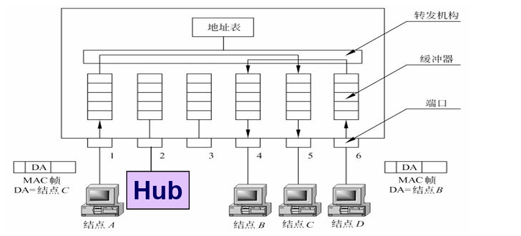

# 局域网组网

## 1.集线器（hub）组网

* 多级集线器的设计，整个互联的网络为一个LAN
* 所有LAN网段处于同一个冲突域（碰撞域）

## 2.交换机（switch）组网

### 2.1 功能与特点

* 整个互联的网络为一个LAN 

* 每个LAN网段是一个独立的冲突域(碰撞域)
* 转发链路层数据帧时运行CSMA/CD算法
* 自学习的，即插即用的
* 支持专用接入和全双工
* 可以连接使用不同以太网技术的以太网网段

### 2.2 交换机的转发过滤

交换机内部：

* 地址表

* 转发机构

* 缓冲器

* 端口

### 2.3交换机的自学习能力

地址表的建立时自动，动态和自主的

* 初始地址表为空
* 对于在一个端口收到的每个入帧，交换机在表中存储该帧的源地址字段的MAC地址，到达的端口号和时间
* 当一个帧到达其中一个端口，并且该帧的目的地址在表中，交换机转发到对应的端口
* 如果该帧的地址不在地址表中，则会转发到所有端口的输出缓冲区
* 如果一段时间（老化时间）后没有接收到表中某个地址作为源地址的帧，交换机将表中这个地址删除