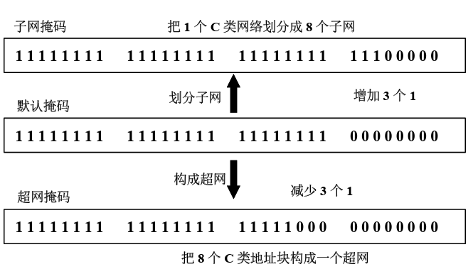

# 子网和超网


## 1.划分子网

* 思想：将一个较大的网络划分成几个较小的子网，每个子网都有自己的子网地址，提升了IP地址的利用率，利于堆网络进行分层管理
* 划分方式：从主机号借用若干比特作为子网号，同时主机号也就减少相应若干比特
* 表现形式：划分子网纯属一个单位内部的是，对外仍表现为没有划分子网的网络
* $IP=\{网络号，子网号，主机号\}$


## 2.子网掩码

$$
（IP地址） AND （子网掩码） = 网络地址
$$

默认子网掩码：

* A：255.0.0.0
* B：255.255.0.0
* C：255.255.255.0

主机需要知道子网号的目的是要判断目的地址是否在同一子网，如果在则直接发送，否则发给路由器

### 2.1 定长子网掩码

每个子网规模一样，容纳主机数相同

### 2.2 变长子网掩码

不同子网使用的子网掩码长度是不同的，一般用于多级子网的划分


## 3.超网



* 超网可以将几个小网络合并成一个大网络
* 条件：
  * 地址个数必须是 2 的整数次方 
  * 这些地址必须是连续的

```
假设下面有4个网络:
172.18.129.0/24
172.18.130.0/24
172.18.132.0/24
172.18.133.0/24
如果这四个进行路由汇聚,能覆盖这四个网络的汇总地址是多少
答案：
1）将各子网地址的网段以二进制写出。
129的二进制代码是10000001
130的二进制代码是10000010
132的二进制代码是10000100
133的二进制代码是10000101
2）比较，从第1位比特开始进行比较，将从开始不相同的比特到末尾位填充为0。由此得到的地址为汇总后的网段的网络地址，其网络位为连续的相同的比特的位数。
3)这四个数的前五位相同都是10000，所以加上前面的172.18这两部分相同的位数，网络号就是10000000,而10000000的十进制数是128，所以，路由汇聚的Ip地址就是172.18.128.0。所以最终答案就是172.18.128.0/21
```


## 4.无类地址