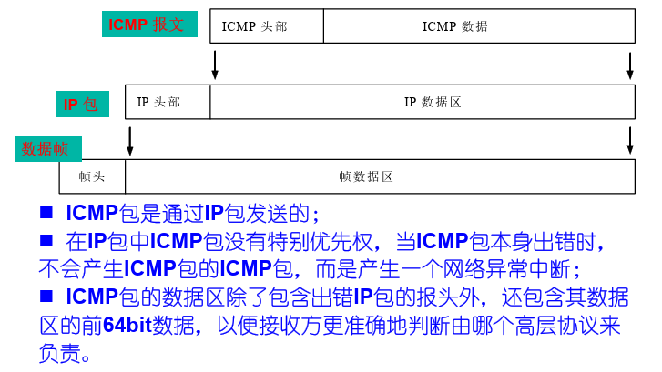

# ICMP协议

>  Internet Control Message Protocol 的缩写，即互联网控制消息协议

# 1.概述

由于 IP 层采用数据报方式，当通信介质或路由器出现故障、目的端主机不可到达、 报文生存定时器超时、路由器或通信线路拥塞等问题出现时， IP 包都无法正常到达目的主机，而源主机却无法判断发送失败的原因

## ICMP协议实现--Ping命令

1. 向目的服务器执行ping命令
2. 目的服务器发送回显应答
3. 源服务器显示相关数据