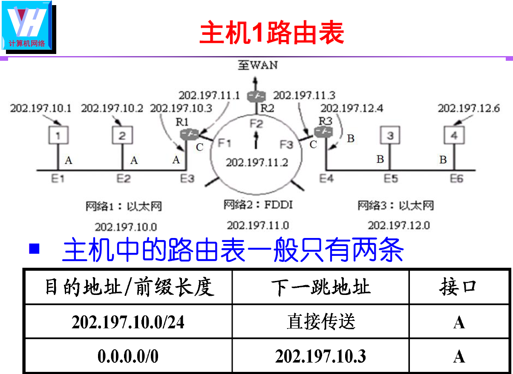
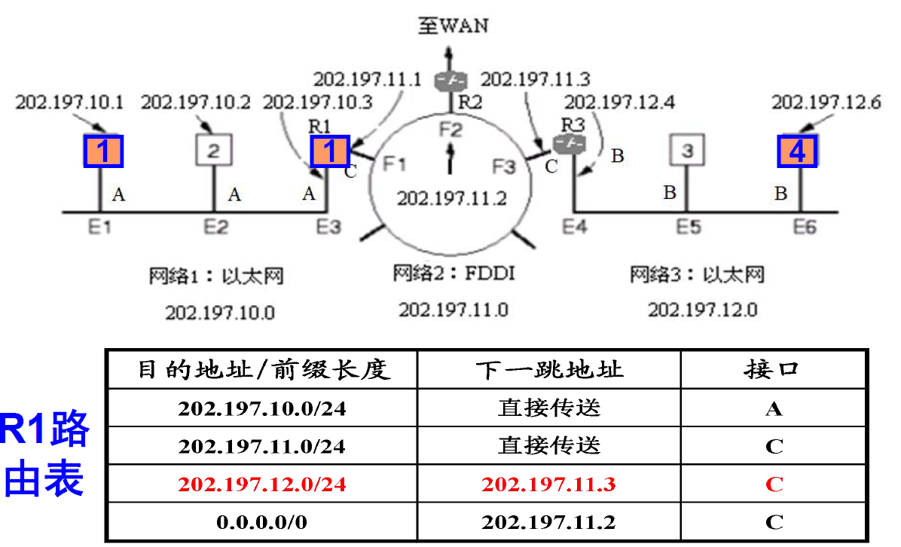

# IP报文转发与路由器

## 1.IP报文转发

*  互联网使用IP路由器转发数据报：
  * 转发forwarding：输入端口到输出端口
  * 路由选择routing：路由表

## 2.IP路由表

* **路由器路由表**：
  * 组成：
    * 目的网络地址/前缀长度
    * 下一跳地址
    * 接口
* **主机路由表**：
  * 路由表中一般只有两条（一个本网络地址，一个0.0.0.0）
  * 当路由表中的目的地址为0.0.0.0时，表示默认路由。默认路由用于指示当没有匹配任何其他路由表项时应该采取的动作。换句话说，当设备要发送数据到一个目标地址，但在路由表中找不到与目标地址匹配的具体路由条目时，设备会使用默认路由来确定数据包的下一跳位置。通常情况下，默认路由设置为设备连接到的网关或者下一个级联路由器的地址。这样，当设备无法确定如何直接到达目标地址时，它会将数据包发送到默认路由指定的下一跳位置，由该位置继续决定如何转发数据包。默认路由在网络中扮演着非常重要的角色，确保数据包在没有明确路由规则的情况下能够正确传输。

## 3.路由和交换机的区别

* 数据在同一网段的转发用**交换机**
* 数据在不同网段的转发用**路由器**
* **路由**：数据从源主机到目标主机的转发过程
* **路由器**：能够将数据包转移到正确目的地，并在转交过程中选择最佳路径的设备
