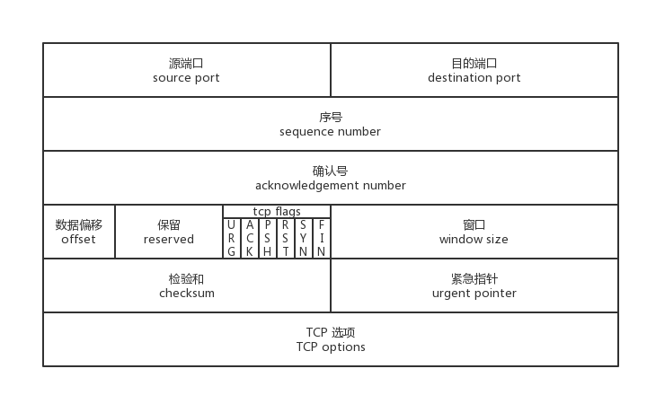

# TCP协议

> *Transmission Control Protocol* 

## 1.服务特性

* 面向连接服务
* 全双工通信
* 支持报文分组
* 支持报文差错控制，顺序控制，应答与重传机制
* 提供流量控制（不会淹没接收方）
* 提供报文拥塞控制（不会淹没路由器）

## 2.TCP报文格式

* 源端口：16bit
* 目的端口：16bit
* 序号：表示本报文段所发送数据的第一个字节编号
* 确认号：表示已确认收到的数据序号
* 数据偏移：表示TCP报文头部的长度
* 保留：3位保留未用
* 标志位

  | 名称 | 说明                                                         |
  | ---- | ------------------------------------------------------------ |
  | URG  | 表示本报文段中发送的数据是否包含紧急数据：URG=1 时表示有紧急数据。当 URG=1 时，后面的紧急指针字段才有效 |
  | ACK  | 表示前面的确认号字段是否有效：ACK=1 时表示有效；只有当 ACK=1 时，前面的确认号字段才有效；TCP 规定，连接建立后，ACK 必须为 1 |
  | PSH  | 告诉对方收到该报文段后是否立即把数据推送给上层。如果值为 1，表示应当立即把数据提交给上层，而不是缓存起来 |
  | RST  | 表示是否重置连接：若 RST=1，说明 TCP 连接出现了严重错误（如主机崩溃），必须释放连接，然后再重新建立连接 |
  | SYN  | 在建立连接时使用，用来同步序号：当 SYN=1，ACK=0 时，表示这是一个请求建立连接的报文段；当 SYN=1，ACK=1 时，表示对方同意建立连接；SYN=1 时，说明这是一个请求建立连接或同意建立连接的报文；只有在前两次握手中 SYN 才为 1 |
  | FIN  | 标记数据是否发送完毕：若 FIN=1，表示数据已经发送完成，可以释放连接 |
* 窗口大小：表示当前报文发送者接受窗口（接收缓冲区还剩多少）的大小，单位一般为字节
* 校验和：checksum=伪头+TCP头+TCP数据（与UDP一样，也有一个IP伪头部）
* 紧急指针：仅在URG标志位开启时有效，紧急指针会指示出紧急数据所在位置

## 3.数据分段与重组

* 分段：

  当用户数据（如一个1GB文件）超过IP包数据区 的最大限制（64KB）时，在发送端必须对用户数据 进行分段，把每一段封装到TCP报文中(不超过 64KB)，并交给IP层发送

* 分段的重组：

  由于IP层采用的是数据报方式通信，由于路由选择 的动态性，因此，同一个用户的多个数据段可能不会 同时到达，甚至不能按发送先后顺序到达，为了保证 TCP连接的可靠性，在接收端必须对TCP报文按发送 顺序号进行报文重组，然后再交给上层协议

## 4.TCP的可靠传输
