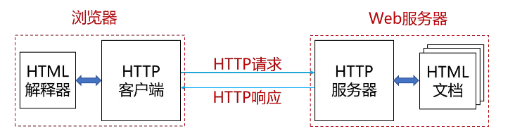
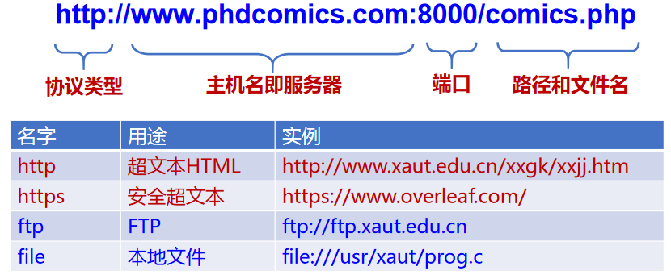

# web与HTTP

## 1.万维网

万维网(World Wide Web, WWW)

* 是Internet中由许多互相链接的资源组成的全球信息资源库，是一种信息共享服务(web服务)。
* HTTP服务器和客户端，以及它们之间执行的HTTP协议

### 1.1 万维网的对象：

* 静态对象与静态网页：HTML，XML，PHP
* 动态对象与动态网页：PHP/JSP+MySQL
* 链接：超链接

### 1.2 万维网的寻址

统一资源定位符URL

### 1.3 万维网的传输

HTTP（HyperText Transfer Protocol）

* HTTP 客户端和HTTP服务器共同构成了万维网的基本组件
* 传输层使用TCP协议，80端口
* HTTP为无状态协议，服务器端不保留之前请求的状态信息

## 2.HTTP协议

传送过程

* 非持久连接
  * HTTP/1.0
  * 每次连接需要经历TCP慢启动阶段
* 持久连接
  * HTTP/1.1，为持久连接
  * 支持流水线机制
  * 降低了响应时间
