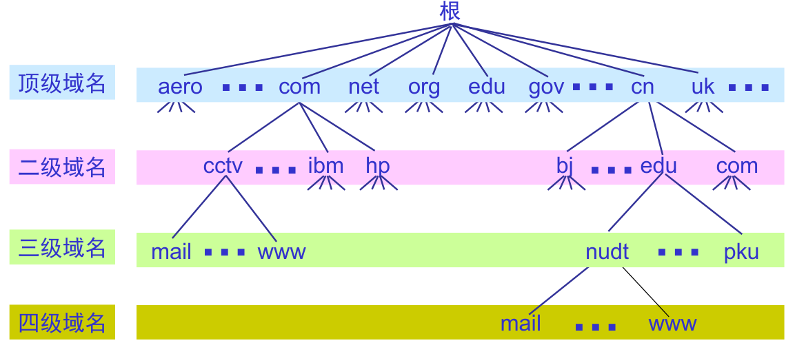

# 域名及解析

## 1.域名

* 域名系统 (Domain Name System, DNS)：

  * 实现域名到ip地址转换
  * 服务模型：C/S模型

* 域名的层次结构：

  

  * 各部分最多63个字符，整个路径不超过255个字符
  * ... 三级域名 . 二级域名 . 顶级域名
  * 举例：www.nudt.edu.cn
  * 叶节点代表主机名，可以只包含一台主机或几千台主机，访问域名www.baidu.com时，是访问该域内上千台服务器中的一台

2.域名解析过程

3.DNS协议格式